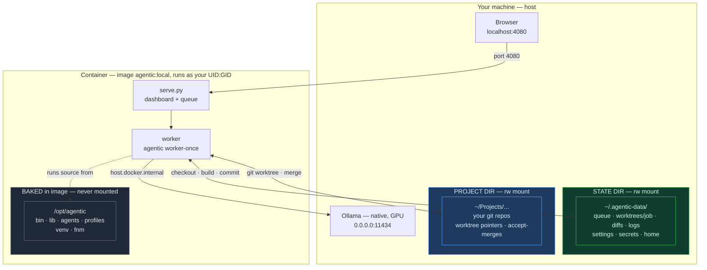

# Agentic

Queue jobs for Claude Code (or a local Ollama model) to work on while you do something else. Review the diffs, merge what you like.

---

## What it does

You submit a request, an agent runs in an isolated git branch, does the work, verifies the build passes, and commits. You come back whenever, look at what it did, and decide whether to merge.

While jobs run, your working tree is untouched — the agent works in a separate `~/.agentic/worktrees/<id>/` checkout. Accepting a job merges the branch into your repo.

---

## Setup (Docker — recommended)

Docker is the supported way to run agentic. `docker compose up` and you land on
the dashboard — no Python, Node, pyenv, or shell config to manage. (Native
install is still available for contributors — see [Native install](#native-install-advanced).)

### Requirements

- **Docker Desktop** — [docker.com](https://www.docker.com/products/docker-desktop/) (running)
- **Ollama** on the host — [ollama.com](https://ollama.com) + a pulled model
  (v1 runs local mode; see [Local model setup](#local-model-setup)).
  Ollama runs on your host (it uses the GPU); the container reaches it over the
  network.

> v1 image is **local mode (Ollama) + TypeScript projects**. Cloud (Claude Code)
> in a container is on the roadmap.

### Steps

```bash
# 1. Get the code  (clone anywhere — this dir is where you run all ./docker/… commands)
git clone <repo-url> ~/agentic-src && cd ~/agentic-src

# 2. Start Ollama on all interfaces so the container can reach it
#    (a plain `ollama serve` binds to localhost only)
OLLAMA_HOST=0.0.0.0:11434 ollama serve &

# 3. Run the setup wizard — it writes docker/.env and scaffolds the state dir
./docker/setup.sh

# 4. Start it
./docker/up.sh --build
```

> **Run every `./docker/…` command from the cloned repo directory** (e.g.
> `~/agentic-src`). They're relative paths — `cd` there first, or you'll get
> `no such file or directory`.

Open [http://localhost:4080](http://localhost:4080), then configure mode/model in
the **Settings** panel. **To stop:** `./docker/down.sh` (from the repo dir).

**The wizard asks for two paths:**
- **Project dir** — the repo (or a `Projects/` parent) agents work on. It's the
  only host code the container can see; the in-app picker browses within it.
- **State dir** — where the queue/worktrees/diffs/logs/settings live. Defaults to
  `~/.agentic-data`, kept separate from the app source (the wizard refuses unsafe
  choices). Pick a repo per job in **Settings → Default project path → Browse…**.

See the [Command reference](#command-reference) below for all start/stop options,
and [docker/README.md](docker/README.md) for the full Docker reference (mount
model, safety, multi-Node via fnm).

---

## How it works (Docker)

The container holds the app; your machine holds the data. The container writes to
exactly **two** host directories (both mounted at their real paths), and the app
source stays **baked in the image** so a mount can never corrupt it. Ollama runs
natively on the host (it uses the GPU) and the container reaches it over the
network.



**A job's lifecycle:** submit in the dashboard → the worker runs `git worktree
add` (checkout into the state dir, pointer into your repo) → installs deps (fnm
picks the Node version, `npm ci`) → runs the agent via host **Ollama** → builds →
commits to `agentic/<job>`. **Accept** merges that branch into your repo;
**Review in IDE** applies it to your working tree.

**Three boundaries:**
- **Baked (gray)** — app source + venv + fnm in the image, never mounted.
- **State dir (green)** — everything the container scratches; isolated from your
  host `~/.npm` / `~/.gitconfig`.
- **Project dir (blue)** — your real repos, touched only by git.

---

## Command reference

> Run these from the **cloned repo directory** (e.g. `~/agentic-src`) — the
> `./docker/…` paths are relative to it. `cd` there first.

Start/stop is done with two wrapper scripts that wrap `docker compose` with the
right `--env-file`/`-f` so you never type those.

### Start / stop

```bash
./docker/setup.sh         # one-time: wizard writes docker/.env + scaffolds state dir

./docker/up.sh            # start (foreground — logs in your terminal; Ctrl-C stops)
./docker/up.sh -d         # start detached (background)
./docker/up.sh --build    # rebuild the image first (after a code/Dockerfile change)
./docker/up.sh -d --build # rebuild + detached

./docker/down.sh          # stop and remove the container (state + repos untouched)
```

### Host prerequisites (before `up`)

```bash
# Docker Desktop must be running.

# Ollama on the host, on all interfaces so the container can reach it.
# A plain `ollama serve` binds to 127.0.0.1 only — inline the env var:
OLLAMA_HOST=0.0.0.0:11434 ollama serve

ollama pull qwen3.6:27b   # or your model of choice (see Model recommendations)
```

### Inspect / manage a running container

```bash
docker logs -f agentic                       # tail the dashboard/worker logs
docker ps --filter name=agentic              # is it running? on what port?
docker exec -it agentic bash                 # shell into the container
./docker/down.sh && ./docker/up.sh -d --build  # rebuild + restart in one line
```

### Change the dashboard port

Edit `HOST_PORT` in `docker/.env` (default `4080`; use `4081` to run alongside a
native server on `4080`), then `./docker/down.sh && ./docker/up.sh -d`.

### Running the container and a native server at once

You can, but **give them different ports AND different state dirs** — otherwise
they fight over `:4080` and corrupt the same queue. `up.sh` refuses to start if
its `HOST_PORT` is already taken (e.g. by a native `agentic serve`). To run both:

- Native on `4080` with state `~/.agentic` (its default).
- Container on `HOST_PORT=4081` with a separate `AGENTIC_STATE_DIR`
  (e.g. `~/.agentic-data`, the wizard's default).

They then have independent queues and dashboards. The simpler path is to run one
at a time: `agentic serve stop` before `./docker/up.sh`, or `./docker/down.sh`
before `agentic serve`.

> Everything else — mode, model, context budget, default repo — is set in the
> browser **Settings** panel, not on the command line.

---

## Native install (advanced)

For contributors or anyone who'd rather run on the host. Needs `jq`, `pyenv`
(pins Python 3.11.9 for the venv), and — for cloud mode — the Claude Code CLI.

```bash
git clone <repo-url> ~/.agentic
bash ~/.agentic/install.sh
source ~/.zshrc
```

Then `cd your-project && agentic serve` (cloud) or `agentic serve --local`
(Ollama). Native mode keeps app source and state together in `~/.agentic`; the
Docker setup keeps them separate (source baked in the image, state in a mounted
dir). All the dashboard/usage docs below apply to both.

---

## Usage

Start the app (`./docker/up.sh` for Docker, or `agentic serve` / `agentic serve
--local` for a native install) and open
[http://localhost:4080](http://localhost:4080). Everything below is the same in
both — the dashboard, jobs, review, and merge workflow are identical.

**Submit a job** — describe what you want and hit Submit (`Cmd+Enter`).

**Run it** — **▶ Run Worker** for one job, **▶▶ Run All** for the queue.

**Review** — click a job to see what the agent did: files read, files modified, commands run, build result, GitHub-style split diff, chain position, phase summary, and estimated cost. Stats and diffs are preserved after you accept or reject the job.

**Merge** — **Accept Chain** collects all chained jobs onto a staging branch (`agent-work/<date>`). You merge that branch into your own work when ready.

```bash
git merge agent-work/20260520-a1b2
```

---

## Cloud vs local

| | Cloud | Local |
|---|---|---|
| Engine | Claude Code CLI | Ollama |
| Quality | Higher | Good for scoped tasks |
| Cost | Anthropic API credits | Free |
| Speed | Fast | Moderate (first job loads model) |
| Privacy | Code sent to Anthropic | Stays on your machine |

Both modes use the same queue, dashboard, worktrees, and review workflow.

---

## Local mode setup

### 1. Install Ollama

```bash
brew install ollama   # or download from ollama.com
```

### 2. Pull a model

Use the standard (non-MLX) variants for reliable tool calling performance:

```bash
# Recommended for Apple Silicon 48GB+
ollama pull qwen3.6:27b

# 16–32GB
ollama pull qwen3.6:14b   # or qwen2.5-coder:14b
```

> **Avoid MLX variants** (`-mxfp8`, `-nvfp4`, `-bf16` tags) — they run through a different Ollama backend that is significantly slower for agentic use cases involving many sequential API calls.

### 3. Create a tuned model

Create a Modelfile to set a reasonable context window and temperature:

```bash
cat > ~/Modelfile-coding <<'EOF'
FROM qwen3.6:27b
PARAMETER num_ctx 131072
PARAMETER temperature 0.2
EOF

ollama create qwen-coder -f ~/Modelfile-coding
```

### 4. Configure

Set your model in `~/.agentic/.agentic.conf`:

```bash
export AGENTIC_LOCAL_MODEL="qwen-coder"
# AGENTIC_CONTEXT_BUDGET=24000   # default — raise if your model has a larger context window
```

### 5. Start

Ollama and the agentic server are separate processes — both need to be running:

```bash
ollama serve &
agentic serve --local
```

**Specify a model on the fly:**

```bash
agentic serve --local=qwen-coder
```

---

## Model recommendations

| RAM | Model | Notes |
|---|---|---|
| 16GB | `qwen3.6:14b` or `qwen2.5-coder:14b` | Use non-MLX variant |
| 32GB | `qwen3.6:27b` | Build qwen-coder Modelfile at 64K ctx |
| 48GB+ | `qwen3.6:27b` | Build qwen-coder Modelfile at 128K ctx |

Browse [ollama.com/library](https://ollama.com/library) — filter by **tools** tag (required for function calling). Download count is the best reliability signal.

---

## Server commands (native install)

For the native install. With Docker, use `./docker/up.sh` / `./docker/down.sh`
(see [Command reference](#command-reference)).

```bash
agentic serve              # cloud, port 4080
agentic serve --local      # local Ollama
agentic serve 8080         # custom port
agentic serve stop
agentic serve status
```

---

## Review workflow

| Action | What it does |
|---|---|
| **Review in IDE** | Apply agent changes to your working tree (unstaged) — review in VS Code, edit in place, then commit or discard (`git checkout -- .`) |
| **Accept** | Merge single job onto base branch |
| **Accept Chain ↓** | Merge whole chain onto one staging branch |
| **Reject** | Delete branch and worktree |
| **Abandon** | Move stuck running job to failed |

After **Accept Chain**, you get `agent-work/<date>`. Merge it into your branch when satisfied.

---

## Chaining jobs

Jobs can build on each other. Fill in the **Chain after** field with a previous job's ID. Each chained job branches from the previous one's committed work, so the agent sees what was actually built.

When a chained job starts, any commits that landed on the main branch after the parent job branched are automatically merged in. This means assets, CLAUDE.md updates, or other changes committed directly to main are always visible to downstream jobs — no manual sync needed.

Run the full chain with **▶▶ Run All** — it executes pending jobs in dependency order.

---

## Configuration

`~/.agentic/.agentic.conf` (gitignored):

```bash
# Local model
export AGENTIC_LOCAL_MODEL="qwen-coder"
# AGENTIC_CONTEXT_BUDGET=24000   # default — raise only if your model has a larger context window

# Ollama host (default: http://localhost:11434)
export OLLAMA_HOST="http://localhost:11434"
export OLLAMA_KEEP_ALIVE="30m"

# Optional: only needed for `agentic plan` and `agentic doc-gen`
export ANTHROPIC_API_KEY=""
export AGENTIC_MODEL="claude-opus-4-8"
```

---

## What the agent does

For each job:

1. Reads `CLAUDE.md` to understand project conventions
2. Detects the project language profile (TypeScript, Game Boy C, …) and builds a symbol map accordingly — `.ts`/`.tsx` exports for TypeScript, C function signatures for Game Boy C
3. Explores relevant source files
4. Implements the requested change
5. Calls `Setup()` — installs dependencies, detects yarn/pnpm/npm automatically
6. Calls `Build()` — reads `package.json` scripts to find the right build command, runs it
7. Runs lint if available
8. Runs Prettier if configured
9. Commits with a descriptive message

**Local mode adds a surgical repair loop on build failure:**
- One error at a time, not all at once
- Edit-only (no broad rewrites in repair mode)
- Locked to files that have errors
- Reverts automatically if repair makes things worse
- 5 escalating strategies before giving up

**Local mode safeguards:**
- `Setup()` and `Build()` tools — purpose-built for install and build steps, eliminating shell spirals
- Thinking mode disabled (`think: false`) — prevents models from spending minutes on internal reasoning per turn
- Spiral detection — 5 consecutive shell commands without a file read or edit triggers a hard stop and forces the model back to reading files
- Destructive command blocking — `rm -rf`, `killall`, `pkill` are blocked outright
- Context compression — old file reads are replaced with symbol maps when approaching the context limit

---

## Job detail page

Click any job to see what the agent did:

- **Stats** — files changed, tool calls, build ✓/✗, lint ✓/✗, token count, estimated API cost
- **Phase summary** — reads / edits / build result / commit in one bar
- **Chain visualizer** — parent → current → children, clickable
- **Files Modified** — per-file expandable GitHub-style split diff (left: removed, right: added)
- **Files Read** — every file explored
- **Commands Run** — each shell command with pass/fail, error output on failure
- **Agent Reasoning** — the full text of what the agent said (collapsible)
- **State History** — timeline of state transitions with timestamps

The detail panel auto-refreshes every 5 seconds while a job is running. Stats, diffs, and activity logs are cached and remain visible after you accept or reject a job.

---

## Dashboard features

- **Search** — filter jobs by request text, repo, or job ID
- **Console** — collapsible and resizable, height saved across sessions
- **Chain editor** — set or change a job's parent from the `⋯` menu
- **Status overrides** — manually move any job to any state from the `⋯` menu

---

## What gets created

```
~/.agentic/
├── queue/
│   ├── pending/      # waiting to run
│   ├── running/      # in progress
│   ├── done/         # ready to review
│   ├── failed/       # build error or agent failure
│   ├── abandoned/    # manually stopped
│   └── cancelled/
├── worktrees/
│   └── j_xxx/        # isolated checkout per job
├── diffs/
│   └── j_xxx.diff    # cached diff — persists after accept/reject
├── logs/
│   └── j_xxx.jsonl   # agent activity log — persists after accept/reject
└── serve.pid
```

In your project: branches named `agentic/<job-id>`. Accept Chain creates `agent-work/<date>`.

---

## Language profiles

Agentic auto-detects your project's language by inspecting files (Makefile contents, `package.json`, etc.) and selects a profile that controls how the agent explores code, parses build errors, and which tools are available.

| Profile | Detected when | Agent tools |
|---|---|---|
| `typescript` | `package.json` present | `Setup`, `Build` |
| `gameboy-c` | Makefile contains `GBDK` or `sdcc` | `Build`, `TileConvert`, `RomUsage`, `Symbols` |

**Game Boy–specific tools (local mode only):**
- `TileConvert(path, name)` — runs `png2asset` to convert a PNG to GBDK tile arrays; auto-pads images to 8px boundaries
- `RomUsage()` — parses the `.map` file and reports Bank 0 / WRAM / HRAM usage with overflow warnings
- `Symbols(filter)` — reads the `.sym` file and lists linked symbols by bank, useful for debugging linker errors

Profile detection is automatic — no configuration needed. The detected profile is stored in the job and shown in the dashboard.

---

## CLAUDE.md

The agent reads `CLAUDE.md` at project root before doing anything. Keep it current — it's the source of truth for naming conventions, import patterns, testing framework, tile index maps, and component patterns.

```bash
agentic doc-gen   # generate from project analysis (profile-aware: TypeScript or Game Boy C)
agentic doc       # open in $EDITOR
```

---

## Other commands

```bash
agentic init          # initialize project
agentic accept <id>   # merge a single job's branch
agentic reject <id>   # discard a job's branch
agentic plan          # create an agile plan
```

---

## First use walkthrough

After running `install.sh` and sourcing your shell, do this once before running any jobs.

### 1. Configure

Copy the example config and fill in what you need:

```bash
cp ~/.agentic/.agentic.conf.example ~/.agentic/.agentic.conf
```

Open it and edit:

```bash
# Cloud mode — needed for agentic plan, doc-gen, and cloud worker
export ANTHROPIC_API_KEY="sk-ant-..."

# Local mode — set the model you pulled with ollama pull
# export AGENTIC_LOCAL_MODEL="qwen-coder"
```

Everything else in the file has working defaults. `AGENTIC_CONTEXT_BUDGET` only matters in local mode.

### 2. Go to your project

All jobs run against a specific repo. Navigate there before starting the server — the dashboard picks up `$PWD` as the default repo for new jobs.

```bash
cd ~/your-project
```

### 3. Generate a CLAUDE.md

The agent reads `CLAUDE.md` at the project root before doing anything. Without it the agent guesses at conventions; with it the output is significantly better.

```bash
agentic doc-gen
```

This calls the Anthropic API to analyze your project and write a `CLAUDE.md`. Review it before running jobs — correct anything wrong about your stack, naming conventions, or test setup. Commit it to the repo so every agent run picks it up.

If you don't have an `ANTHROPIC_API_KEY` yet, skip this step and create a minimal `CLAUDE.md` by hand:

```bash
agentic doc   # opens $EDITOR with an empty or existing CLAUDE.md
```

### 4. Start the server and run your first job

```bash
agentic serve          # cloud (Claude Code)
agentic serve --local  # local (Ollama)
```

Open [http://localhost:4080](http://localhost:4080), type a request, and click **▶ Run Worker**.

---

MIT License
