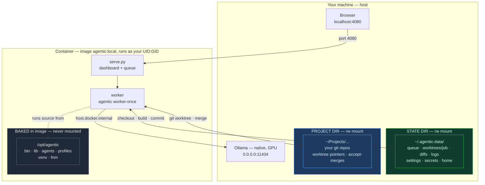

# Agentic

Queue jobs for Claude Code (or a local Ollama model) to work on while you do something else. Review the diffs, merge what you like.

---

## What it does

You submit a request, an agent runs in an isolated git branch, does the work, verifies the build passes, and commits. You come back whenever, look at what it did, and decide whether to merge.

While jobs run, your working tree is untouched — the agent works in a separate `~/.agentic/worktrees/<id>/` checkout. Accepting a job merges the branch into your repo.

---

## Setup (Docker — recommended)

Docker is the supported way to run agentic. `docker compose up` and you land on
the dashboard — no Python, Node, pyenv, or shell config to manage.

### Before you start — what a fresh machine needs

Jobs run on a **backend you pick per job**: **Local** (Ollama) or **Cloud**
(Claude Code). You can use one or both. Install only what the backends you want
require.

**Always required (host):**

- **Docker Desktop**, running — [docker.com](https://www.docker.com/products/docker-desktop/).
  Everything else (Python, Node, git, jq, the `claude` CLI) is **baked into the
  image** — you do **not** install those on the host.

**For LOCAL jobs (Ollama) — host only:**

- **Ollama**, running on the host on all interfaces (it uses the GPU; the
  container reaches it over the network) — [ollama.com](https://ollama.com).
  Start it with the env inline so it binds beyond localhost **and** allows two
  concurrent generations (a planning chat alongside a worker):
  ```bash
  OLLAMA_HOST=0.0.0.0:11434 OLLAMA_NUM_PARALLEL=2 ollama serve &
  ```
  > This host `OLLAMA_NUM_PARALLEL` is what actually controls Ollama concurrency.
  > Match it to the `Max local in parallel` value in the dashboard's Settings
  > (default 2) — that one only sizes agentic's own dispatch pool.
- **A pulled model.** The default model name agentic expects is
  `qwen-coder:latest`; either build it (see [Local model setup](#local-model-setup-ollama))
  or `ollama pull <model>` and set that name in **Settings → Local model**.

**For CLOUD jobs (Claude Code) — no host install:**

- The `claude` CLI is **already in the image**. You only need an
  **`ANTHROPIC_API_KEY`**, which you paste into the dashboard's **Settings** gear
  after first launch. It is stored in `secrets.json` (mode 0600) inside your
  mounted **state dir** — never baked into the image, never sent to the browser,
  never committed. No env var or compose wiring is needed.

> **Nothing to set in a shell or env file for the key.** The only things the
> wizard writes (to `docker/.env`) are your **project dir**, **state dir**,
> `HOST_UID`/`HOST_GID` (auto-detected — needed so the non-root cloud worker can
> write files), the port, and the Ollama URL.

### Steps

```bash
# 1. Get the code  (clone anywhere — this dir is where you run all ./docker/… commands)
git clone <repo-url> ~/agentic-src && cd ~/agentic-src

# 2. (Local jobs only) Start Ollama on all interfaces + parallelism, then pull a model
OLLAMA_HOST=0.0.0.0:11434 OLLAMA_NUM_PARALLEL=2 ollama serve &
ollama pull qwen2.5-coder:14b      # or build `qwen-coder` per "Local model setup"

# 3. Run the setup wizard — writes docker/.env (project dir, state dir, HOST_UID/GID,
#    port, Ollama URL) and scaffolds the state dir
./docker/setup.sh

# 4. Start it
./docker/up.sh --build
```

> **Run every `./docker/…` command from the cloned repo directory** (e.g.
> `~/agentic-src`). They're relative paths — `cd` there first, or you'll get
> `no such file or directory`.

Open [http://localhost:4080](http://localhost:4080). Then in the **Settings**
gear: pick a **default project** (Browse…), set your **Local model** and/or
**Cloud model**, and — for cloud jobs — **paste your `ANTHROPIC_API_KEY`**.
Per job, choose **Local** or **Cloud** with the Backend picker on the submit
form (changeable on a pending job's card). **To stop:** `./docker/down.sh`.

**The wizard asks for two paths:**
- **Project dir** — the repo (or a `Projects/` parent) agents work on. It's the
  only host code the container can see; the in-app picker browses within it.
- **State dir** — where the queue/worktrees/diffs/logs/settings live. Defaults to
  `~/.agentic-data`, kept separate from the app source (the wizard refuses unsafe
  choices). Pick a repo per job in **Settings → Default project path → Browse…**.

See the [Command reference](#command-reference) below for all start/stop options,
and [docker/README.md](docker/README.md) for the full Docker reference (mount
model, safety, multi-Node via fnm).

---

## How it works (Docker)

The container holds the app; your machine holds the data. The container writes to
exactly **two** host directories (both mounted at their real paths), and the app
source stays **baked in the image** so a mount can never corrupt it. Ollama runs
natively on the host (it uses the GPU) and the container reaches it over the
network.



**A job's lifecycle:** submit in the dashboard → the worker runs `git worktree
add` (checkout into the state dir, pointer into your repo) → installs deps (fnm
picks the Node version, `npm ci`) → runs the agent via host **Ollama** → builds →
commits to `agentic/<job>`. **Accept** merges that branch into your repo;
**Review in IDE** applies it to your working tree.

**Three boundaries:**
- **Baked (gray)** — app source + venv + fnm in the image, never mounted.
- **State dir (green)** — everything the container scratches; isolated from your
  host `~/.npm` / `~/.gitconfig`.
- **Project dir (blue)** — your real repos, touched only by git.

---

## Command reference

> Run these from the **cloned repo directory** (e.g. `~/agentic-src`) — the
> `./docker/…` paths are relative to it. `cd` there first.

Start/stop is done with two wrapper scripts that wrap `docker compose` with the
right `--env-file`/`-f` so you never type those.

### Start / stop

```bash
./docker/setup.sh         # one-time: wizard writes docker/.env + scaffolds state dir

./docker/up.sh            # start (foreground — logs in your terminal; Ctrl-C stops)
./docker/up.sh -d         # start detached (background)
./docker/up.sh --build    # rebuild the image first (after a code/Dockerfile change)
./docker/up.sh -d --build # rebuild + detached

./docker/down.sh          # stop and remove the container (state + repos untouched)
```

### Host prerequisites (before `up`)

```bash
# Docker Desktop must be running.

# Ollama on the host, on all interfaces so the container can reach it.
# A plain `ollama serve` binds to 127.0.0.1 only — inline the env var:
OLLAMA_HOST=0.0.0.0:11434 ollama serve

ollama pull qwen3.6:27b   # or your model of choice (see Model recommendations)
```

### Inspect / manage a running container

```bash
docker logs -f agentic                       # tail the dashboard/worker logs
docker ps --filter name=agentic              # is it running? on what port?
docker exec -it agentic bash                 # shell into the container
./docker/down.sh && ./docker/up.sh -d --build  # rebuild + restart in one line
```

### Change the dashboard port

Edit `HOST_PORT` in `docker/.env` (default `4080`), then
`./docker/down.sh && ./docker/up.sh -d`.

> Everything else — model, context budget, default repo, and your API key — is
> set in the browser **Settings** panel, not on the command line. Each job's
> **backend** (Local or Cloud) is chosen per job on the submit form.

---

## Usage

Start the app with `./docker/up.sh` and open
[http://localhost:4080](http://localhost:4080).

**Submit a job** — describe what you want, pick its **Backend** (🏠 Local /
☁ Cloud) and Priority, and hit Submit (`Cmd+Enter`). You can change a pending
job's backend later from its card.

**Run it** — **▶ Run Worker** for one job, **▶▶ Run All** to drain the queue.
Both pools run concurrently (local + cloud), capped by the slot settings; the
header chip shows `local u/m · cloud u/m · queued`.

**Review** — click a job to see what the agent did: files read/modified, commands run, build result, GitHub-style split diff, chain position, phase summary, and estimated cost. Stats and diffs are preserved after you accept or reject the job.

**Merge** — **Accept** merges a job's branch into **your current branch** (the
one you have checked out — no staging branch, no extra step). **Accept Chain**
merges every job in a chain, in order, into the current branch. A merge conflict
stops there for you to resolve in your IDE.

---

## Backends (per job)

Each job runs on the backend you pick when you submit it (changeable while it's
pending). Both run from one server — no global mode switch.

| | 🏠 Local | ☁ Cloud |
|---|---|---|
| Engine | Ollama (on your host) | Claude Code (`claude` CLI, baked into the image) |
| Quality | Good for scoped tasks | Higher |
| Cost | Free | Anthropic API credits |
| Speed | Moderate (first job loads model) | Fast |
| Privacy | Stays on your machine | Code sent to Anthropic |
| Needs | a pulled Ollama model | an `ANTHROPIC_API_KEY` in Settings |

Concurrency per backend is capped in **Settings**: `Max local in parallel`
(default 2 — match it to the host `ollama serve`'s `OLLAMA_NUM_PARALLEL`) and the
cloud worker cap (default 4). Both pools run at the same time.

---

## Local model setup (Ollama)

Needed only if you run **Local** jobs.

### 1. Install Ollama

```bash
brew install ollama   # or download from ollama.com
```

### 2. Pull a model

Use the standard (non-MLX) variants for reliable tool calling performance:

```bash
# Recommended for Apple Silicon 48GB+
ollama pull qwen3.6:27b

# 16–32GB
ollama pull qwen3.6:14b   # or qwen2.5-coder:14b
```

> **Avoid MLX variants** (`-mxfp8`, `-nvfp4`, `-bf16` tags) — they run through a different Ollama backend that is significantly slower for agentic use cases involving many sequential API calls.

### 3. Create a tuned model

Create a Modelfile to set a reasonable context window and temperature:

```bash
cat > ~/Modelfile-coding <<'EOF'
FROM qwen3.6:27b
PARAMETER num_ctx 131072
PARAMETER temperature 0.2
EOF

ollama create qwen-coder -f ~/Modelfile-coding
```

### 4. Set the model name in the dashboard

The container reaches your host Ollama over the network (started in
[Before you start](#before-you-start--what-a-fresh-machine-needs)). In the
dashboard's **Settings → Local model**, set the name you pulled or built (the
default is `qwen-coder:latest`). That's it — submit a job with the **Local**
backend.

---

## Model recommendations

| RAM | Model | Notes |
|---|---|---|
| 16GB | `qwen3.6:14b` or `qwen2.5-coder:14b` | Use non-MLX variant |
| 32GB | `qwen3.6:27b` | Build qwen-coder Modelfile at 64K ctx |
| 48GB+ | `qwen3.6:27b` | Build qwen-coder Modelfile at 128K ctx |

Browse [ollama.com/library](https://ollama.com/library) — filter by **tools** tag (required for function calling). Download count is the best reliability signal.

---

## Review workflow

| Action | What it does |
|---|---|
| **Review in IDE** | Apply agent changes to your working tree (unstaged) — review in VS Code, edit in place, then commit or discard (`git reset && git checkout -- .`). If the base moved and it conflicts, the button becomes **Resolve merge** and writes conflict markers to resolve. |
| **Accept** | Merge the job's branch into your **current** branch (HEAD) |
| **Accept Chain ↓** | Merge the whole chain, in order, into your **current** branch |
| **Reject** | Delete branch and worktree |
| **Abandon** | Move a stuck running job to failed |

**Accept** and **Accept Chain** merge straight into the branch you have checked out — no staging branch, no extra `git merge` step. A conflict stops there for you to resolve in your IDE.

---

## Chaining jobs

Jobs can build on each other. Fill in the **Chain after** field with a previous job's ID. Each chained job branches from the previous one's committed work, so the agent sees what was actually built.

When a chained job starts, any commits that landed on the main branch after the parent job branched are automatically merged in. This means assets, CLAUDE.md updates, or other changes committed directly to main are always visible to downstream jobs — no manual sync needed.

Run the full chain with **▶▶ Run All** — it executes pending jobs in dependency order.

---

## Configuration

Everything is set in the dashboard's **Settings** gear (persisted to
`settings.json` in your state dir) — there are no config files to edit by hand.
Key knobs:

| Setting | What it does |
|---|---|
| **Local model** | the Ollama model local jobs run (default `qwen-coder:latest`) |
| **Cloud model** | the Claude model cloud jobs run (`auto` lets the CLI pick) |
| **Max local in parallel** | local worker pool size (default 2 — match the host `ollama serve`'s `OLLAMA_NUM_PARALLEL`) |
| cloud worker cap | cloud worker pool size (default 4) |
| **Default project** | repo new jobs target (Browse…, confined to the project dir) |
| context budget / max turns / etc. | local-worker tuning, all with working defaults |
| **Pause chains for review** | hold each chain link until you Accept its parent |

The **`ANTHROPIC_API_KEY`** (cloud) is set in the same panel and stored in
`secrets.json` (0600) — never shown back to the browser, never committed, never
baked into the image. Container/network settings (`OLLAMA_HOST`, port, project
dir, `HOST_UID/GID`) live in `docker/.env`, written by the wizard.

---

## What the agent does

For each job:

1. Reads `CLAUDE.md` to understand project conventions
2. Detects the project language profile (TypeScript, Game Boy C, …) and builds a symbol map accordingly — `.ts`/`.tsx` exports for TypeScript, C function signatures for Game Boy C
3. Explores relevant source files
4. Implements the requested change
5. Calls `Setup()` — installs dependencies, detects yarn/pnpm/npm automatically
6. Calls `Build()` — reads `package.json` scripts to find the right build command, runs it
7. Runs lint if available
8. Runs Prettier if configured
9. Commits with a descriptive message

**Local mode adds a surgical repair loop on build failure:**
- One error at a time, not all at once
- Edit-only (no broad rewrites in repair mode)
- Locked to files that have errors
- Reverts automatically if repair makes things worse
- 5 escalating strategies before giving up

**Local mode safeguards:**
- `Setup()` and `Build()` tools — purpose-built for install and build steps, eliminating shell spirals
- Thinking mode disabled (`think: false`) — prevents models from spending minutes on internal reasoning per turn
- Spiral detection — 5 consecutive shell commands without a file read or edit triggers a hard stop and forces the model back to reading files
- Destructive command blocking — `rm -rf`, `killall`, `pkill` are blocked outright
- Context compression — old file reads are replaced with symbol maps when approaching the context limit

---

## Job detail page

Click any job to see what the agent did:

- **Stats** — files changed, tool calls, build ✓/✗, lint ✓/✗, token count, estimated API cost
- **Phase summary** — reads / edits / build result / commit in one bar
- **Chain visualizer** — parent → current → children, clickable
- **Files Modified** — per-file expandable GitHub-style split diff (left: removed, right: added)
- **Files Read** — every file explored
- **Commands Run** — each shell command with pass/fail, error output on failure
- **Agent Reasoning** — the full text of what the agent said (collapsible)
- **State History** — timeline of state transitions with timestamps

The detail panel auto-refreshes every 5 seconds while a job is running. Stats, diffs, and activity logs are cached and remain visible after you accept or reject a job.

---

## Dashboard features

- **Search** — filter jobs by request text, repo, or job ID
- **Console** — collapsible and resizable, height saved across sessions
- **Chain editor** — set or change a job's parent from the `⋯` menu
- **Status overrides** — manually move any job to any state from the `⋯` menu

---

## What gets created

```
~/.agentic/
├── queue/
│   ├── pending/      # waiting to run
│   ├── running/      # in progress
│   ├── done/         # ready to review
│   ├── failed/       # build error or agent failure
│   ├── abandoned/    # manually stopped
│   └── cancelled/
├── worktrees/
│   └── j_xxx/        # isolated checkout per job
├── diffs/
│   └── j_xxx.diff    # cached diff — persists after accept/reject
├── logs/
│   └── j_xxx.jsonl   # agent activity log — persists after accept/reject
└── serve.pid
```

In your project: branches named `agentic/<job-id>` (one per job). Accept and
Accept Chain merge these into your current branch; Reject deletes them.

---

## Language profiles

Agentic auto-detects your project's language by inspecting files (Makefile contents, `package.json`, etc.) and selects a profile that controls how the agent explores code, parses build errors, and which tools are available.

| Profile | Detected when | Agent tools |
|---|---|---|
| `typescript` | `package.json` present | `Setup`, `Build` |
| `gameboy-c` | Makefile contains `GBDK` or `sdcc` | `Build`, `TileConvert`, `RomUsage`, `Symbols` |

**Game Boy–specific tools (local mode only):**
- `TileConvert(path, name)` — runs `png2asset` to convert a PNG to GBDK tile arrays; auto-pads images to 8px boundaries
- `RomUsage()` — parses the `.map` file and reports Bank 0 / WRAM / HRAM usage with overflow warnings
- `Symbols(filter)` — reads the `.sym` file and lists linked symbols by bank, useful for debugging linker errors

Profile detection is automatic — no configuration needed. The detected profile is stored in the job and shown in the dashboard.

---

## CLAUDE.md

The agent reads `CLAUDE.md` at project root before doing anything. Keep it current — it's the source of truth for naming conventions, import patterns, testing framework, tile index maps, and component patterns.

```bash
agentic doc-gen   # generate from project analysis (profile-aware: TypeScript or Game Boy C)
agentic doc       # open in $EDITOR
```

---

## Other commands

The dashboard covers the normal flow; these CLI commands are for scripting or
advanced use. In Docker, run them inside the container
(`docker compose -f docker/docker-compose.yml exec agentic agentic <cmd>`).
Accept/Reject are also buttons in the UI.

```bash
agentic init          # initialize project
agentic accept <id>   # merge a single job's branch
agentic reject <id>   # discard a job's branch
agentic plan          # create an agile plan
```

---

## First use walkthrough

Once `./docker/up.sh` is running and the dashboard is open:

### 1. Configure in Settings (the gear)

- **Default project** — Browse… to the repo agents work on (confined to the
  project dir you set in the wizard).
- **Local model** and/or **Cloud model** — the model each backend runs.
- **Cloud jobs:** paste your **`ANTHROPIC_API_KEY`** (stored in `secrets.json`,
  0600; never leaves the box).

### 2. Add a CLAUDE.md to your project (recommended)

The agent reads `CLAUDE.md` at the project root before doing anything. Without it
it guesses at conventions; with it the output is significantly better. Write one
by hand, or have a job generate one ("Write a CLAUDE.md documenting this
project's stack, conventions, and test setup"). Review and commit it so every
run picks it up.

### 3. Run your first job

Type a request, pick its **Backend** (🏠 Local / ☁ Cloud) and Priority, Submit,
then **▶ Run Worker**. Click the job to review the diff, and **Accept** to merge
it into your current branch.

---

MIT License
