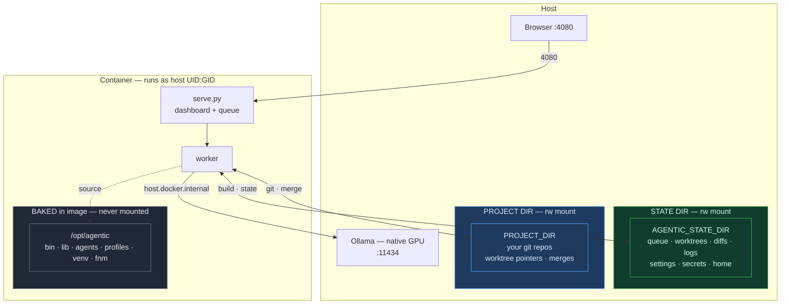

# Running agentic in Docker

`docker compose up` and you land on the dashboard at `http://localhost:4080` —
then configure mode, model, and context in the browser. No shell env vars to
manage; the only host config is a few paths the wizard writes for you.

**v1 scope:** local mode, TypeScript projects. Ollama runs **on the host** (it
needs the GPU); the container reaches it over the network. There is no `ollama`
and no `claude` CLI inside the image.

---

## Quick start

```bash
# 1. Start the host's Ollama on all interfaces so the container can reach it.
#    A plain `ollama serve` binds to 127.0.0.1 only — inline the env var.
#    OLLAMA_NUM_PARALLEL=2 lets a planning chat run alongside a worker job
#    instead of queueing behind it (see "Planning while a job runs" below):
OLLAMA_HOST=0.0.0.0:11434 OLLAMA_NUM_PARALLEL=2 ollama serve &

# 2. Run the wizard — it writes docker/.env and scaffolds the state dir.
./docker/setup.sh

# 3. Start it.
./docker/up.sh --build
```

Open `http://localhost:4080` (or your chosen port) → **Settings** → confirm mode
**local** + model, then submit a job. **Stop with `./docker/down.sh`.**

`up.sh` / `down.sh` wrap `docker compose` with the right `--env-file`/`-f`:

```bash
./docker/up.sh            # foreground (Ctrl-C stops)
./docker/up.sh -d         # detached (background)
./docker/up.sh --build    # rebuild image first
./docker/down.sh          # stop + remove the container (state/repos untouched)

docker logs -f agentic    # tail logs
docker ps --filter name=agentic   # running? what port?
```

The raw form (if you prefer it) is
`docker compose --env-file docker/.env -f docker/docker-compose.yml up`.

The wizard asks for two paths and detects the rest (uid/gid, port, Ollama URL):

- **Project dir** — the repo, or a `Projects/` parent, agents work on. The only
  host code the container can see; the in-app picker browses within it.
- **State dir** — queue / worktrees / diffs / logs / settings / secrets. Defaults
  to `~/.agentic-data`. Kept **separate** from any agentic source checkout — the
  wizard refuses a source dir, a system path, or anything overlapping the project
  dir.

Prefer to write `docker/.env` by hand? Copy `.env.example` and fill it in — but
the wizard's validation is the safer path.

---

## Architecture



App source is baked in the image (never mounted). The container writes to exactly
two host dirs — the state dir (everything it scratches) and the project dir (git
ops only). Ollama stays on the host. The two rules below make this safe.

---

## The two rules that matter

### 1. Identity mounts

`git worktree add` bakes **absolute realpath() strings** into git's gitdir files;
`accept`/`remove` later read those literal paths. So the project dir and the
state dir are mounted at the **same absolute path** inside the container as on the
host. `docker-compose.yml` does this with `${PATH}:${PATH}` mounts — don't remap
the targets.

### 2. Source and state are separate

- **App source** (incl. the Python venv) is **baked into the image** at
  `/opt/agentic` and is **never mounted**. The code finds it via `AGENTIC_APP` /
  `AGENTIC_PYTHON`.
- **State** lives only in your mounted state dir (`AGENTIC_STATE_DIR`).

This separation is why the container never writes source into your mount. The
entrypoint is **create-only** — it `mkdir`s state dirs and runs `git config`, and
contains **no `rm`, no `chown -R`, no symlinking into the mount** (a build-time
check fails the image if a destructive command is ever added). As a last line of
defense, the entrypoint **refuses to start** if the state dir looks like a source
checkout (`.git` / `lib` / `bin`), is a system path, or overlaps the project dir.

---

## `.env` variables

The wizard writes these; listed for reference / manual editing.

| Var | What | Notes |
|-----|------|-------|
| `AGENTIC_STATE_DIR` | host state dir | identity-mounted; **not** a source checkout. Named so a native shell's `AGENTIC_HOME` can't shadow it. |
| `PROJECT_DIR` | host project(s) dir | identity-mounted; what the picker browses (`BROWSE_ROOT` inside the container = this). |
| `HOST_HOME` | your host home | for `Path.home()` alignment; not mounted. |
| `HOST_UID` / `HOST_GID` | from `id -u`/`id -g` | files created in mounts stay yours. |
| `HOST_PORT` | dashboard port (4080) | use `4081` to coexist with a native server on 4080. |
| `OLLAMA_HOST` | host Ollama URL | `http://host.docker.internal:11434`. |

App source is **not** an `.env` var — compose hardcodes `AGENTIC_APP=/opt/agentic`.

---

## Picking the repo for a job

In the dashboard: **Settings → Default project path → Browse…**, then pick a git
repo (marked ●) under your project dir. That sets `default_repo` for new jobs — no
`.env` edit, no restart. The picker is a read-only folder browser (`/api/browse`),
**confined to the project dir** (rejects `..` and symlink escapes). Because it's
an identity mount, the path resolves the same inside the container, so worktrees
and accept/remove work.

> The submit form's recent-repos dropdown shows only repos with job history — use
> **Browse…** to reach any repo under the mount.

---

## Node versions (fnm)

The image has **no baked Node** — [fnm](https://github.com/Schniz/fnm) manages it,
so different projects can use different versions:

- Default is a current LTS (Node 20).
- If a project pins a version via `.nvmrc`, `.node-version`, or
  `engines.node`, the worker installs+activates that version before building.
- Dependencies are installed with a **frozen lockfile** (`npm ci` /
  `--frozen-lockfile`) before the baseline build, so the build is real and the
  lockfile is never modified (no churn in the job's diff).

---

## Planning while a job runs

You can chat in a planning thread while a worker job is running — but a single
Ollama instance **serializes requests by default**, so an all-local setup
(local worker + local planning) makes the chat **wait behind the worker's turns**
(often a multi-minute hang). Two ways to make concurrent work feel instant:

1. **Let Ollama serve in parallel** — start it with `OLLAMA_NUM_PARALLEL=2`
   (see Quick start). The worker and a planning question then run at the same
   time. Costs extra VRAM/compute; a large model on a memory-tight machine may
   not fit a second slot, so test it.
2. **Plan in the cloud, execute locally** — set the planning **thread's backend
   to cloud (Claude)** in its header dropdown. Planning hits the API while the
   worker keeps Ollama to itself — zero contention, no VRAM pressure. Needs an
   `ANTHROPIC_API_KEY`. This is the most reliable path on constrained hardware.

The app detects when both would contend on local Ollama and nudges you toward
option 2.

---

## Coexisting with a native server

The native install binds `127.0.0.1:4080`; the container publishes
`${HOST_PORT}:4080`. Set `HOST_PORT=4081` in `.env` to run both at once. (They
also use different state dirs, so they don't share a queue.)

---

## Deferred (not in v1)

- **Cloud-mode image** (bundles the `claude` CLI + auth + HTTPS egress).
- **gameboy-c image** (adds `make`/`sdcc`/`png2asset`/`rgbds`).
- Containerizing Ollama — not viable on macOS/Apple Silicon (no Metal GPU
  passthrough); it stays on the host.
